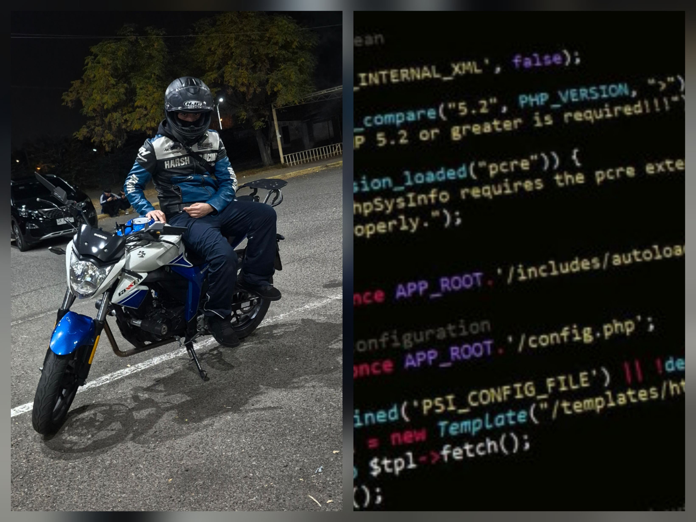

## ¡Hola! Soy David Parra 👋

### Tecnologías que manejo:

Soy estudiante de 2do año de Ingeniería en Informática en la UTEM y me apasiona resolver problemas a través del código. Combino mis estudios con mi trabajo técnico en APPAREIL, lo que me ha dado un enfoque práctico para el desarrollo de software y la implementación de soluciones.

Aquí tienes un poco más sobre mí:

- 🔭 **Actualmente trabajo en:** Mi rol técnico en APPAREIL y de UBER.
- 🌱 **Actualmente estoy aprendiendo:** Profundizando en estructuras de datos con **C++**, gestión de bases de datos con **SQL**, e interfaces móviles con **React Native** y **Firebase**.
- 👯 **Busco colaborar en:** Proyectos open-source de desarrollo móvil o scripts de automatización.
- 🤔 **Busco ayuda con:** Arquitecturas escalables para aplicaciones móviles y optimización de bases de datos.
- 💬 **Pregúntame sobre:** Python, React Native, SQL o sobre cómo cambiar el sistema de escape de una moto. 
- 📫 **Cómo contactarme:** https://www.linkedin.com/in/david-ignacio-parra-pontillo/ o davidignaciopontillo@gmail.com
- 😄 **Pronombres:** Él / Him
- ⚡ **Dato curioso:** Cuando no estoy codeando, probablemente me encuentres haciéndole mantenimiento a mi Suzuki Gixxer 150 (¡ahorrando para una GSX250R SF!), entrenando calistenia, explorando los cerros de San José de Maipo, o simplemente compartiendo mi espacio de trabajo con mi gata.

### 🛠️ Tecnologías y Herramientas
* **Lenguajes:** Python, C++, SQL
* **Frontend & Móvil:** React Native
* **Backend & BaaS:** Firebase

